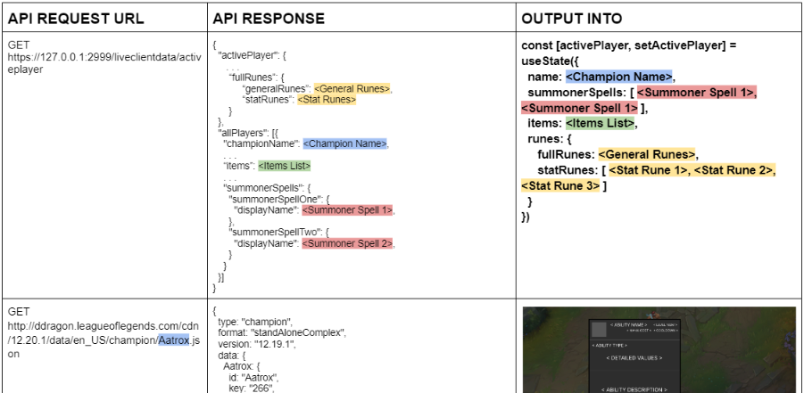
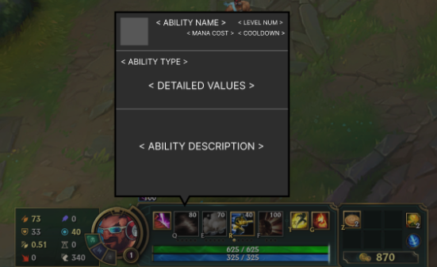
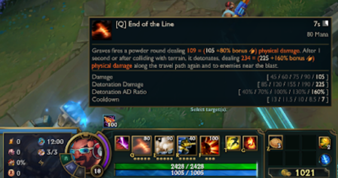
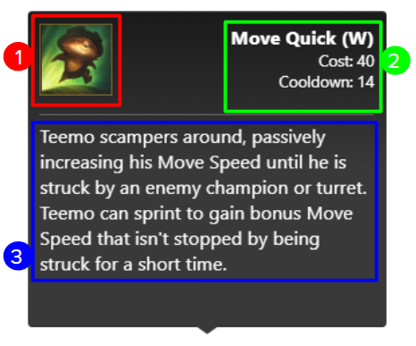
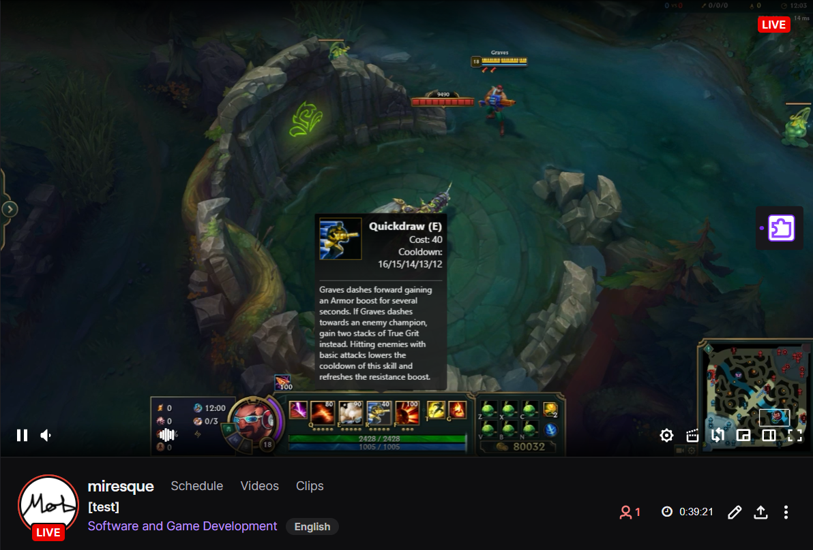
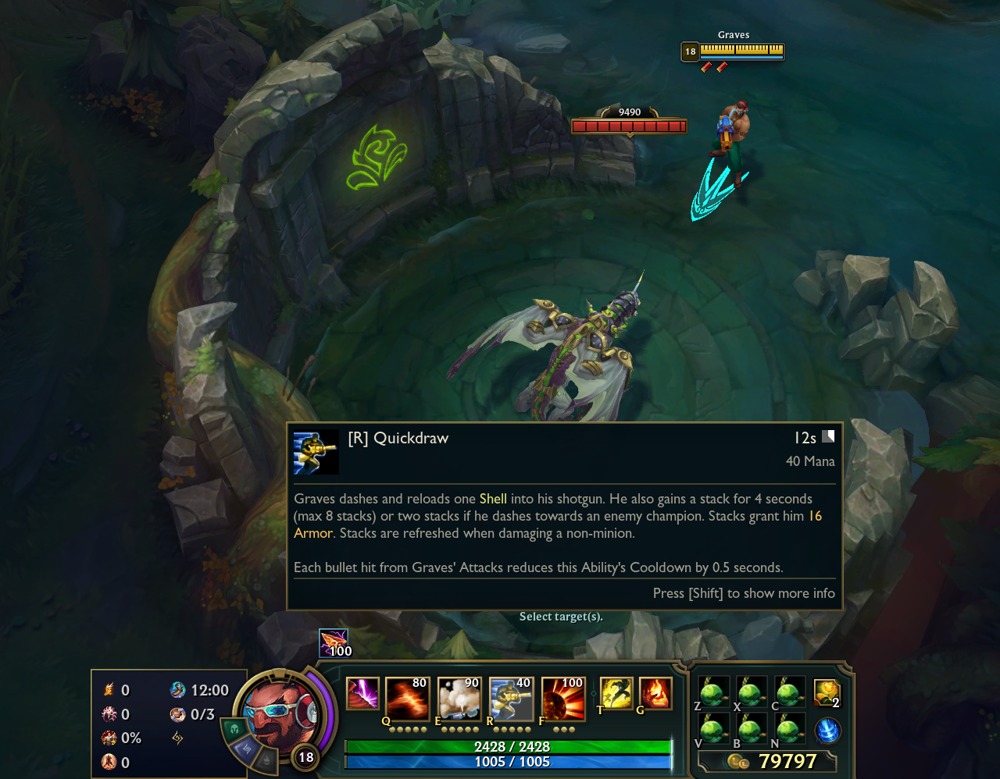

# Welcome to Champion Tooltips (extension for Twitch.tv)

<a name="readme-top"></a>

## About The Project


This is an extension for the popular online game, League of Legends(LoL), where viewers can interact with the live view of the stream to check out detailed information about the abilities that their favourite streamers are currently using in-game.

### Motivation

This project came about after a great period of frustration towards Riot Games for not supplying their users with enough detailed information on champion abilities within the LoL client and having to rely on obnoxious third-party sources for said information.

After being inspired by bukka & SUNSfanTV's solution to a similar problem for another game, DotA 2, I decided to also implement a seamlessly integrated experience for viewers of LoL content to make the game more accessible and informative.

## Getting Started?

So far the project is in the prototype stage, so it is not live within the twitch extension library for live testing. For a live demonstration please email me at [mirkilinc@gmail.com](mailto:mirkilinc@gmail.com).

## Journey

### Planning & Design

To start I first had to identify what technologies I would need to create this app. After extensively reading through the [Twitch Extension Docs](https://dev.twitch.tv/docs/extensions/), modern frontend frameworks/libraries such as [React.js](https://reactjs.org/docs/getting-started.html) seemed to be fully supported by twitch so this was a perfect fit.

I chose React specifically because this is the javascript library I am most familiar and comfortable with, but it also gives me all the necessary features needed for the app, such as React Hooks: [useState](https://reactjs.org/docs/hooks-state.html) & [useEffect](https://reactjs.org/docs/hooks-effect.html). These features allowed me to conditionally render in the tooltips using a functional method rather than relying on classes, this made setting up the components and passing information through them easier. Also, there are useful React-specific node packages out there for me to use freely, like [react-tooltip](https://www.npmjs.com/package/react-tooltip).

Since I would need to gather information related to League of Legends and the live game data I used the [Live Client Data API](https://developer.riotgames.com/docs/lol#game-client-api_live-client-data-api) and [Data Dragon](https://developer.riotgames.com/docs/lol#data-dragon), both provided by Riot Games itself.



Above is a snippet of a API request & response table that let me plan out what type of API calls I would need to make to gather all the necessary information I need.

Below is the initial wireframe I came up with, the design had to be different to the in-game gui as I had to stay within the bounds of Riot Games' terms and services.

Designed tooltip wireframe             |  In-game LoL tooltip
:-------------------------:|:-------------------------:
  |  

### API calls

To view the code that carries out the API calls please check out the [apiRequests.jsx](src/utils/apiRequests.jsx) file.



Before constructing the tooltip I first have to know which champion the player is currently using, to grab this information I use the 'Live Client Data API':

```
GET https://127.0.0.1:2999/liveclientdata/activeplayer  // for the summoner name
```

Response Example:

```
"Jkrr" 
```

Then I filtered the results using the summoner name to find our player and which champion they are currently playing:

```
GET https://127.0.0.1:2999/liveclientdata/allgamedata
```

Response example for 'allgamedata' can be found [here](https://static.developer.riotgames.com/docs/lol/liveclientdata_sample.json).

Next I request the champion's information using the 'Data Dragon API':

```
GET https://ddragon.leagueoflegends.com/cdn/12.22.1/data/en_US/champion/<Champion Name From Filtered 'allgamedata'>.json
```

Response example for Champion Data can be found [here](https://ddragon.leagueoflegends.com/cdn/12.22.1/data/en_US/champion/Teemo.json).

After gathering this data I then move onto constructing the tooltip object.

1) ```js
   const spellIconUrl = `https://ddragon.leagueoflegends.com/cdn/12.22.1/img/spell/${Spell Name Obtained From Champion Information}`
   ```

   This is placed into an img tag in the tooltip component:

   ```html
   
   ```

2) After using the '.map' array method on all the abilities from the 'Champion Data', I end up with an 'ability' object that contains the specific spell information needed to populate the Tooltip Component.

    The Header of the tooltip is constructed with:

    ```html
    <div>
        <h4>{ability.name}</h4>
        {dataTip !== "Passive" && (
        <>
            <p className="manacost">{"Cost: " + ability.costBurn}</p>
            <p className="cooldown">{"Cooldown: " + ability.cooldownBurn}</p>
        </>
        )}
    </div>
    ```

3) Finally the spell description is populated like this:

    ```html
    <main className="tooltip-main">
        <p className="spell-description">{ability.description}</p>
    </main>
    ```

Champion Tooltips' tooltip             |  In-game LoL tooltip
:-------------------------:|:-------------------------:
  |  

<!-- ROADMAP -->
## Roadmap

- [x] Prototyping
- [ ] 100% Champion Coverage & Integration
  - [ ] Beta testing
- [ ] Public release on Twitch.tv platform
- [ ] More detailed tooltips

## Contact

Mirkan Kilinc - mirkilinc@gmail.com

Project Link: [https://github.com/miresque/champion-tooltips](https://github.com/miresque/champion-tooltips)


<p align="right">(<a href="#readme-top">back to top</a>)</p>
